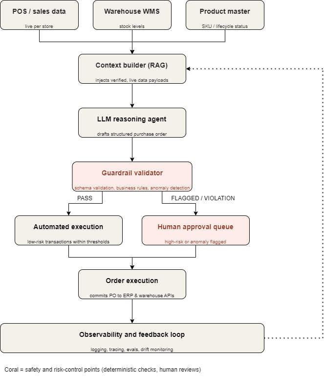

# Task 5: LLM – Agentic AI (Safety & Reliability Architecture)

## 1. System Architecture Overview
This sub-module contains the zero-trust, deterministic validation engine designed to secure an autonomous retail inventory agent handling 500 stores.It actively mitigates hallucinations, stops out-of-bounds orders, and blocks unauthorized product procurement transactions.

The diagram below maps out the end-to-end software pipeline, wrapping the untrusted LLM planner with strict data grounding and runtime guardrails:

---

## 2. Core Safety Guardrails Implemented

### A. Prompt Engineering — Enforcing Behavioral Structure
The pilot agent's original prompt was too loose. To fix rogue behavior, production prompt implements:
* **Strict Output Schema:** Enforces a rigid JSON format (containing `store_id`, `sku`, `quantity`, `reasoning`, and `cited_sales_window`). This forces structured output rather than unpredictable free text.
* **Justification Citations:** Forces the agent to explicitly state the sales window and warehouse data it evaluated. While this doesn't stop a hallucination, it makes it completely detectable by the validation layer.
* **Deterministic Boundaries:** Hard constraints are explicitly listed as negative constraints ("never order discontinued SKUs"). However, because prompts are probabilistic, this serves as the first line of defense, not the only line of defense.
* **Few-Shot Trajectories:** Includes clear examples of valid orders alongside explicit examples of correct refusal paths (e.g., how the model should behave when encountering a discontinued item).

### B. Context Engineering — Data Grounding & Isolation
Hallucinations occur when an LLM pulls information from its internal training memory instead of real enterprise data. Resolve this by ensuring:
* **Retrieval, Not Recall:** All sales figures, live warehouse stock levels, and product master statuses are strictly pulled via real-time database lookups and injected into the prompt context at runtime. The model is never left to estimate numbers.
* **Scoped Context Windows:** Instead of flooding the prompt window with data for all 500 stores simultaneously, isolate execution to process a single store and SKU slice at a time. This eliminates cross-store confusion and context degradation.
* **Data Provenance Tags:** Every piece of structural context carries a timestamp and status flag (`[STATUS: ACTIVE]`), allowing downstream safety systems to verify the age and validity of the data.

### C. Harness Engineering — System Safety & Interception
The LLM's output is always treated as an unverified draft, never as an active command. A hardcoded, testable Python code layer acts as the safety harness between the model and the core systems:
* **Schema Validation:** Instantly rejects malformed or corrupted JSON formats before any internal logic evaluates them.
* **Deterministic Rule Engine:** Runs hard checks (`SKU status != discontinued` and `quantity <= available stock`). This is exactly what intercepts and blocks rogue orders—relying on clean code rather than hoping the LLM follows instructions.
* **Statistical Anomaly Detection:** Compares the proposed order quantity against a 90-day baseline for that specific store and SKU. Orders that are wildly outside historical norms are automatically intercepted.
* **Human-in-the-Loop Escalation:** Orders exceeding safety thresholds or triggering anomaly warnings are safely rerouted to a human approval queue instead of auto-executing. Safe, low-risk orders are processed instantly.
* **Self-Correction & Circuit Breaker Loop:** If an order fails validation, the specific error exceptions are fed back into the LLM context to let it self-correct. If it continues to fail after a set limit, the circuit breaker trips, halts execution, and escalates the issue to a human administrator.
* **System Observability:** Every single draft, error flag, and human override is saved to log files. This establishes a continuous feedback loop to evaluate drift and create automated evaluation suites for long-term reliability.

---

## 3. Core Alignment with Evaluation Criteria

* **Technical Competence:** Demonstrates complete system design integration across enterprise data pipelines, RAG patterns, and a custom Python rule-engine execution layer.
* **Problem-Solving Approach:** Maps each of the three specific pilot failures directly to a structural root cause (Prompt vs. Context vs. Harness) with concrete engineering solutions.
* **Code Quality:** The code module leverages clean dataclasses, strict type hinting, single-responsibility functions, and a clear separation between validation logic and system orchestration.
* **Bonus Implementation:** Implements advanced production-ready features, including automated error self-correction loops, statistical anomaly detection thresholds, and system observability logging.
